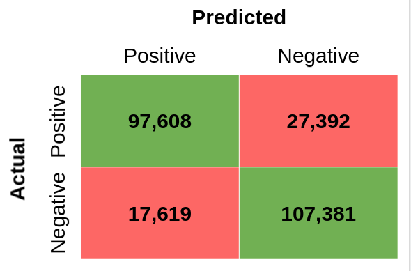

# Sentiment Analysis of Book Reviews

Sentiment analysis is the use of natural language processing to extract and quantify subjective information from text. A basic task in sentiment analysis is classifying the polarity of a given text into positive and negative expressed opinion. The most common application of sentiment analysis is detecting the sentiment of product reviews in marketing and customer service.

In this project, I decided to work on the sentiment analysis of customer reviews for digital books purchased from Amazon. The digital books category on the Amazon website has the largest collection of reviews. Since the book department contains any book topics, the vocabulary of the review corpus is the most diverse and sophisticated. Also, the presence of exaggerations, negations, sarcasm, metaphors, euphemisms, and other kinds of figure of speech makes the book reviews one of the the most complicated sentiment analysis tasks.

## NLP Techniques for Text Classification

The natural language processing techniques for text classification can be classified in 2 categories:

### 1 - Word Embedding
- Generate static distributional representations for words
- Disregard context in which the word is used in a given sentence
- Poor modeling of ambiguous words and lacking coverage for out-of-vocabulary words
- Examples: BoW, TF-IDF, word2vec, GloVe ...

### 2 - Language Model
- Generate contextual word embedding that use as input word constituents 
- Generate representations for out-of-vocabulary words by combining the word pieces
- Examples: ELMo, ULMFiT, Open AI GPT, BERT, ...

As an example, a language model, such as BERT, can interpret the bank meaning by understanding the context in these 2 sentences:

<table>
  <tr>
    <td>I</td>
    <td>arrived</td>
    <td>at</td>
    <td>the</td>
    <td>bank</td>
    <td>after</td>
    <td>crossing</td>
    <td>the</td>
    <td>river.</td>
  </tr>
  <tr>
    <td>I</td>
    <td>arrived</td>
    <td>at</td>
    <td>the</td>
    <td>bank</td>
    <td>after</td>
    <td>crossing</td>
    <td>the</td>
    <td>road.</td>
  </tr>
</table>

## Exploratory Data Analysis
As mentioned in the previous part, the Amazon reviews for digital books dataset has been used in this work. This dataset can be downloaded from the link <a href="https://s3.amazonaws.com/amazon-reviews-pds/tsv/amazon_reviews_us_Digital_Ebook_Purchase_v1_01.tsv.gz">here</a>.

The Amazon digital book reviews dataset consists of reviews from amazon. The data span a period of 18 years, including ~5.1 million reviews on more than 613 thousand book titles by 2.1 million reviewers up to March 2013. Reviews include product and user information, ratings, and plaintext review title and body. A look at the review titles show that a lot of titles are simple phrases such as great book or great read. It shows that the titles have a lot of weight in showing the review sentiment. So I combined the review titles and bodies.

Review Title  | # reviews
------------- | ---------
Great book    | 28,596
Great read    | 22,227
Good read     | 21,341
Awesome       | 21,208
Amazing       | 18,583
Love it!      | 17,637
Great         | 16,958
Excellent     | 15,451
Great Book    | 15,011
Loved it      | 14,825

Also, the following table shows the top 10 most rated book titles on Amazon. Different volumes of Fifty Shades and Hunger Games have some the highest number of reviews.

Product Title                                   | # reviews
----------------------------------------------- | ---------
Fifty Shades of Grey (Fifty Shades, Book 1)     | 11,872
The Hunger Games (Hunger Games Trilogy, Book 1) | 11,709
Gone Girl: A Novel                              | 9,437
Catching Fire (Hunger Games Trilogy, Book 2)    | 7,983
Mockingjay (Hunger Games Trilogy, Book 3)       | 7,428
Inferno: A Novel (Robert Langdon Book 4)        | 7,045
Hopeless                                        | 5,856
Fifty Shades Freed (Fifty Shades, Book 3)       | 5,657
Fifty Shades Darker (Fifty Shades, Book 2)      | 5,637
Safe Haven                                      | 5,474

 

In order to interpret the mood and emotions, I used TextBlob which is a python library for Natural Language Processing (NLP). TextBlob uses a pre-defined dictionary classifying negative and positive words. In this process, a text messsage will be represented by bag of words. After assigning individual scores to all the words, final sentiment is calculated by some pooling operation like taking average of all the sentiments. The polarity can vary between -1 and 1, where -1 means a negative sentiment, +1 means a positive sentiment, and 0 means neutral.

 

This figure shows the histogram of sentiment polarity for all digital book reviews. As can be seen, the sentiment is mainly distributed around 0.2 which indicates that in general, the reviews have relatively positive sentiments. In other words, users mostly review books in a positive way.

\
 

This bar plot shows the mean sentiment polarity for each rating star. There is a strong correlation between the mean sentiment polarity and the rating star. The mean sentiment polarity increases from around 0 for the 1-star ratings to 0.3 for 5-star ratings.

\
 

The following figure shows the histograms of sentiment plarity for 1, 3, and 5-star ratings. As can be seen, even though the distribution for the higher rating reviews have a higher mean than the lower rating ones, the 1-star distribtion largly overlaps the 5-star one. Therefore, more sophisticated techniques are needed to analyze the sentiment of these reviews.

\
 

This figure shows the rating counts from 1 to 5 star. It can be seen that the majority of reviews are rated 4 and 5 stars, meaning that the dataset is heavily imbalanced for classification. For this study, the 1, 2, and 3-star ratings are considered as negative reviews (labeled 0). On the other hand, the 4 and 5-star ratings are considered as positive reviews (labeled 1). One million reviews were randomly sampled from the dataset evenly distributed between the negative and positive reviews. 

\
 

## Methodology
BERT, or Bidirectional Embedding Representations from Transformers, is a new method of pre-training language representations which obtains state-of-the-art results on a wide array of Natural Language Processing (NLP) tasks. BERT is a deeply bidirectional, unsupervised language representation, pre-trained using only a plain text corpus. Context-free models such as word2vec or GloVe generate a single word embedding representation for each word in the vocabulary, where BERT takes into account the context for each occurrence of a given word. For instance, whereas the vector for "bank" will have the same word2vec vector representation for both of its occurrences in the sentences "I arrived at the bank after crossing the river." and "I arrived at the bank after crossing the road.", BERT will provide a contextualized embedding that will be different according to the sentence. In this study, I used DistilBERT model. DistilBERT is a small, fast, cheap and light Transformer model trained by distilling BERT base. It has 40% less parameters than bert-base-uncased, runs 60% faster while preserving over 95% of BERT’s performances as measured on the GLUE language understanding benchmark.

\
 

## Tokenization
The first step to make the corpus machine-readable for BERT model is tokenizing the sequence. Tokens are a part of a sentence which is usually a word but can also be a subword. The tokenizer converts the tokens to ids through a look-up table. I did an analysis on the length of the sequences and the majority of review sequences are shorter than 200 tokens. So, I used the first 200 tokens to truncate the reviews which could significantly help with the computational speed and memory.

\
 

## ML Models
First I used DistilBERT to train only the classifier layers. I train the model on a balanced subsample of 750,000 reviews with a binary class of positive and negative reviews. I used PyTorch and 3 epochs. I had to use an instance on Amazon Sagemaker with 48 CPU and 96 GiB of memory and it took less than 6 hours to train the classifiers. The final f1-score was 0.86 on a test set with 250,000 samples.

Accuracy | Precision | Recall | F1-score | Train time
 ------- | --------- | ------ | -------- | ----------
 0.85    | 0.84      | 0.87   | 0.86     | 5h:48m

 Then I repeated the task with the same architecture, but this time I trained all layers. I used the same instance on the same training set and it took more than 24 hours for training. The f1 score substantially improved to 0.91.

Accuracy | Precision | Recall | F1-score | Train time
 ------- | --------- | ------ | -------- | ----------
 0.90    | 0.90      | 0.92   | 0.91     | 24h:32m

 As a benchmark, I used the traditional TF-IDF to process the same train dataset. This time, I used XGBoost to train the classifier. On the same AWS instance, it took less than 10 minutes to train the model. The f1 score was 0.81 and there was a wider gap between the precision and recall, meaning that the model has more bias to predict negative than positive.

Accuracy | Precision | Recall | F1-score | Train time
 ------- | --------- | ------ | -------- | ----------
 0.82    | 0.85      | 0.78   | 0.81     | 00h:09m

## Key Findings
- BERT based models have much higher metrics for Text classification.
- Training the whole model on the new corpus improves the metrics.
- Traditional word embedding methods are orders of magnitude faster than BERT based.

## Future Steps
- Benchmark BERT for multi-class modeling
- Develop a dashboard

## Technologies Used in This Project

